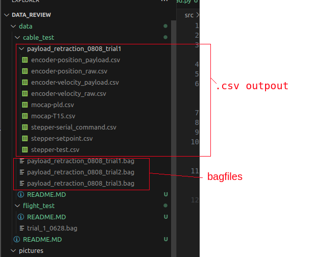

# Rosbag Data Display

- This folder contains all jupyter notebook and python scripts to display data in .bag files.
- Load and save bag files to .csv files first before displaying.
- Note that for .py file the default path
- If you use jupyter notebook, it is recommended to restart the kernel everytime you make significant changes to your code, or you change code in utils package.

## How to use

- Download .bag file from google drive put it to `\data` folder or sub-folders. For example, [cable_test](../data/cable_test/README.MD) contains rosbag files from cable retraction testing.
- An exmple of placing the bag files are shown in the following picture:

- Run the bag parse script in `/bag_load` directory to save bag files into .csv files. For example, `/bag_load/ros_bag_cable_test_load.py` will parse and save cable retraction test data into .csv files.
- Run the .py or .ipynb scriptes in `/data_display` to plot the data. For example, `/data_display/cable_test_review.ipynb` will plot the result of cable retraction testing.
